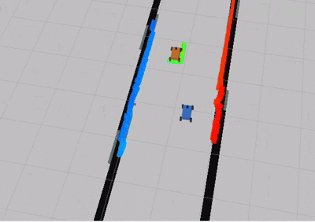

# Roboracer (F1TENTH Gym) — Perception-Centric Pipeline

This repository is a **course project** built on top of the **f1tenth_gym** simulation stack.
The project’s main focus is the **opponent perception module** (2D LiDAR-based detection + tracking).
To develop, test, and demonstrate downstream usage, the repository also includes a minimal end-to-end pipeline (global waypoint publishing, optional local planning, and a Pure Pursuit controller).

---

## Overview

**Core contribution:** opponent perception in simulation (inspired by ForzaETH’s pipeline, with adaptations and simplifications).

- **Detection:** LiDAR preprocessing + clustering + noise filtering + geometry/size estimation (adapted from ForzaETH-style flow)
- **Tracking:** single-opponent EKF tracking to produce a stable opponent state estimate

The rest of the system (planning/control) is intentionally lightweight and serves as supporting infrastructure.

---

## System Architecture

### Data flow (high level):
```text
2D LiDAR (/scan)
↓
Perception
└─ /perception/obstacles
└─ /perception/ready
↓
(Optional) Local Planner
└─ /planner/avoidance/otwpnts
└─ /local_planner/ready
↓
Controller
└─ /drive
└─ /opp_drive
↓
Simulator (f1tenth_gym_ros bridge)
```

### Global path reference:
```text
global_planner
↓
/global_centerline
(and /global_raceline interface)
```

---

## Demos

Short demo clips are available (trimmed due to long trajectories), including:
- tracking-only runs
- tracking + overtaking runs

### Opponent Tracking


### Tracking with Overtaking



---

## Quick Start

> The main entry point is the bringup launch files.

### Run the full system (default map)
```bash
ros2 launch roboracer_f110_bringup full_system.launch.py
```

### Select a racetrack
```bash
ros2 launch roboracer_f110_bringup full_system.launch.py map_name:=Austin
```

### RViz preset
```bash
ros2 launch roboracer_f110_bringup full_system.launch.py rviz_profile:=follow
```

## Maps and Spawn Configuration

- Track CSVs are loaded from the f1tenth_gym_ros package under:
`maps/f1tenth_racetracks/<map_name>/...`

- The ego vehicle start pose is configured in `f1tenth_gym_ros` (e.g., `config/sim.yaml`).

Detailed launch parameters and configuration notes are documented in `roboracer_f110_bringup` [README](roboracer_f110_bringup/README.md).

## Packages

## Packages

- **`perception/`**    [README](perception/README.md)
  Opponent detection and tracking (main project focus).  

- **`global_planner/`**    [README](global_planner/README.md)
  Publishes pre-defined centerline / raceline waypoints from CSV.  

- **`local_planner/`**    [README](local_planner/README.md)
  Frenet-based local avoidance planner producing overtaking waypoints.  

- **`controller/`**    [README](controller/README.md)
  Pure Pursuit controller with optional overtaking path switching.  

- **`localization/`**    [README](localization/README.md)
  Offline static wall map generation for optional perception filtering.  

- **`roboracer_interfaces/`**    [README](roboracer_interfaces/README.md)
  Custom ROS 2 message definitions.  

- **`roboracer_utils/`**    [README](roboracer_utils/README.md)
  Shared utilities.  

- **`roboracer_f110_bringup/`**    [README](roboracer_f110_bringup/README.md)
  Launch files and global configuration to run the system.  

## Notes / Limitations

The tracking module is designed around a single dynamic opponent assumption.

The controller is a stable baseline (Pure Pursuit), prioritizing robustness over lap-time optimality.

The current setup is simulation-focused and uses 2D LiDAR as the primary sensor.

## Acknowledgements

The perception pipeline is inspired by the open-source ForzaETH approach, with project-specific adaptations and simplifications.