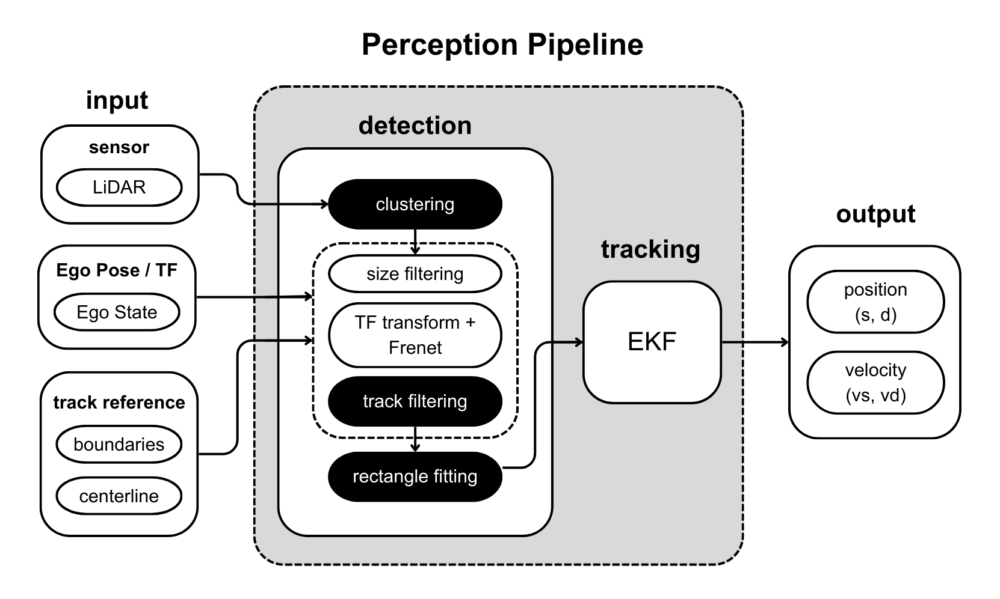

# Perception Package

This package implements a lightweight opponent perception pipeline for head-to-head racing. It takes **2D LiDAR scans** as the primary sensor input, detects obstacle candidates on the track, and tracks a **single opponent** in Frenet coordinates using an EKF.

The pipeline is split into two main nodes:
- **Detection** (`detect.py`): LiDAR clustering + geometric filtering + track/wall filtering + rectangle fitting
- **Tracking** (`opponent_tracker.py`): single-opponent association + EKF in Frenet space + static/dynamic classification

> Note: `ekf_vs_gt_monitor.py` is only used for visualization/monitoring and is not part of the core pipeline.

---

## Pipeline Overview

### Detection (`detect.py`)
The detection node converts `LaserScan` points into the ego `base_link` frame, performs **adaptive breakpoint clustering**,
filters clusters by size/geometry, and removes clusters that likely correspond to **track boundaries / static walls**.
For each remaining cluster, it fits an oriented square/rectangle and publishes:
- RViz markers for debugging
- A raw obstacle list in **Frenet space** (`s, d`), suitable for tracking

Key stages (matching the diagram):
1. **LaserScan → base_link points** using static extrinsic TF
2. **Clustering** using Adaptive Breakpoint Clustering (range-dependent threshold)
3. **Track / wall filtering**
   - Uses `global_centerline` to build a Frenet converter and track boundary arrays
   - Optionally subtracts a precomputed `static_map.npz` wall model
4. **Rectangle fitting** on each kept cluster
5. Publish raw obstacles (`/perception/raw_obstacles`) and visualization markers

### Tracking (`opponent_tracker.py`)
The tracking node performs **single-opponent tracking** in Frenet coordinates with an EKF:
- State: **[s, vs, d, vd]ᵀ**
- Motion model: constant velocity (CV) in both `s` and `d`
- Measurement: derived from detections (`s, d`) + frame-to-frame velocity estimate

It includes:
- **Nearest-neighbor association** (single target) with gating in `(s, d)`
- **Initialization from two consecutive detections** (to estimate initial velocity)
- **Time-to-live (TTL)** logic to drop the target if it is not observed for several frames
- A simple **static/dynamic classifier** based on recent `|vs|` history (hysteresis thresholds)

Only **dynamic** targets are published to downstream planning.

---

## ROS Interfaces

### Subscribed Topics

| Topic | Type | Used by | Description |
|------|------|---------|-------------|
| `/scan` | `sensor_msgs/LaserScan` | `detect.py` | 2D LiDAR scan used for clustering and obstacle extraction |
| `/ego_racecar/odom` | `nav_msgs/Odometry` | `detect.py` | Ego pose (used to cache transform timing and compute ego `s`) |
| `/global_centerline` | `roboracer_interfaces/WaypointArray` | both | Track reference: provides centerline + `s` + boundaries (`d_left`, `d_right`) |

### Published Topics (Core)

| Topic | Type | Published by | Description |
|------|------|--------------|-------------|
| `/perception/raw_obstacles` | `roboracer_interfaces/ObstacleArray` | `detect.py` | Raw obstacle candidates in Frenet space (`s_center`, `d_center`, size bounds) |
| `/perception/obstacles` | `roboracer_interfaces/ObstacleArray` | `opponent_tracker.py` | Final tracked opponent state (single dynamic target): position + velocity (`vs`, `vd`) + variances |
| `/perception/ready` | `roboracer_interfaces/Ready` | `opponent_tracker.py` | `ready=true` once global path / Frenet converter is initialized |

### Published Topics (Visualization / Debug)

| Topic | Type | Published by | Description |
|------|------|--------------|-------------|
| `/perception/markers` | `visualization_msgs/MarkerArray` | `detect.py` | Fitted rectangles (CUBE markers in `map`) |
| `/perception/boundaries` | `visualization_msgs/Marker` | `detect.py` | Track boundary points visualization (SPHERE_LIST) |
| `/perception/static_walls` | `visualization_msgs/MarkerArray` | `detect.py` | Static wall model visualization (if enabled) |
| `/perception/breakpoints` | `visualization_msgs/MarkerArray` | `detect.py` | Debug marker channel (used for boundary related visuals) |
| `/perception/static_dynamic_marker_pub` | `visualization_msgs/MarkerArray` | `opponent_tracker.py` | Tracked target marker: red=dynamic, blue=static, yellow=unknown |
| `/perception/raw_obstacles_markers` | `visualization_msgs/MarkerArray` | `opponent_tracker.py` | All raw obstacles as spheres in `map` |

---

## Parameters

### Most Important Parameters (You will likely tune these)

#### Detection (`detect.py`)
| Name | Default | Meaning |
|------|---------|---------|
| `max_viewing_distance` | `9.0` | Maximum forward region considered for perception (also affects boundary-related filtering) |
| `min_points_per_cluster` | `5` | Minimum LiDAR points per cluster to keep |
| `min_obs_size` | `5` | Minimum cluster size used as an obstacle candidate filter |
| `max_obs_size` | `0.8` | Maximum fitted obstacle size in meters (filters large wall-like detections) |
| `lambda_angle` | `5 deg` | Breakpoint clustering angular parameter (controls splitting threshold) |
| `sigma` | `0.01` | Range noise model in clustering threshold |
| `use_static_map` | `False` | Enable precomputed static wall subtraction |
| `static_tol` | `0.2` | Tolerance in `d` when matching an obstacle to static walls |

#### Tracking (`opponent_tracker.py`)
| Name | Default | Meaning |
|------|---------|---------|
| `rate` | `20.0` | Tracker update rate (Hz) |
| `ttl_frames` | `40` | Frames to keep predicting without observation before dropping target |
| `assoc_max_dist_s` | `6.0` | Association gate in `s` (meters along track) |
| `assoc_max_dist_d` | `1.0` | Association gate in `d` (meters lateral) |
| `init_v_max` | `6.0` | Reject initialization if the inferred speed exceeds this value |
| `var_pub_max` | `0.5` | Do not publish if EKF variance on `s` is too large |
| `static_speed_thresh` | `0.25` | Average `|vs|` below → classify as static |
| `dynamic_speed_thresh` | `0.6` | Average `|vs|` above → classify as dynamic |
| `class_min_samples` | `8` | Minimum speed samples before classification |
| `meas_var_*` | see code | Measurement noise covariance for EKF |
| `process_var_*` | see code | Process noise covariance for EKF |

---

### Secondary / Advanced Parameters (usually keep default)

#### Detection (`detect.py`)
| Name | Default | Meaning |
|------|---------|---------|
| `min_2_points_dist` | `0.1` | Minimum point spacing used inside rectangle fitting |
| `static_map_path` | absolute path | Path to `static_map.npz` used by static wall subtraction |

#### Tracking (`opponent_tracker.py`)
| Name | Default | Meaning |
|------|---------|---------|
| `P_vs, P_d, P_vd` | `0.0, 0.0, 0.4` | Optional “soft pull” terms inside prediction (can be set to 0) |
| `ratio_to_path` | `0.6` | Target speed ratio when using global path velocity reference |
| `use_target_vel_when_lost` | `False` | If enabled, keeps predicting `vs` towards path target speed when target is lost |
| `smooth_len` | `5` | Moving average length used to smooth `vs/vd` outputs |
| `mahalanobis_gate` | `9.0` | Declared but currently not enforced in the association pipeline |

---

## Notes & Known Limitations

- **Single opponent assumption:** the tracker maintains only one target and uses a simple nearest-neighbor selection.
- **Track reference required:** both nodes rely on `/global_centerline` to initialize the Frenet converter.
- **Static wall subtraction is optional:** enable `use_static_map` only if `static_map.npz` exists and matches the track.
- The detection node publishes in Frenet by converting fitted rectangle centers from `map` → `(s,d)`.

---

## Quick Start (Typical Usage)

1. Launch your simulator/stack such that the following are available:
   - `/scan`
   - `/ego_racecar/odom`
   - `/global_centerline` (latched / transient local)

2. Start perception nodes:
   - `detect.py`
   - `opponent_tracker.py`

3. Confirm readiness:
   - `/perception/ready` publishes `ready=true` after global path is received.

4. Visualize (RViz):
   - `/perception/markers` (fitted rectangles)
   - `/perception/static_dynamic_marker_pub` (tracked target, colored by class)
